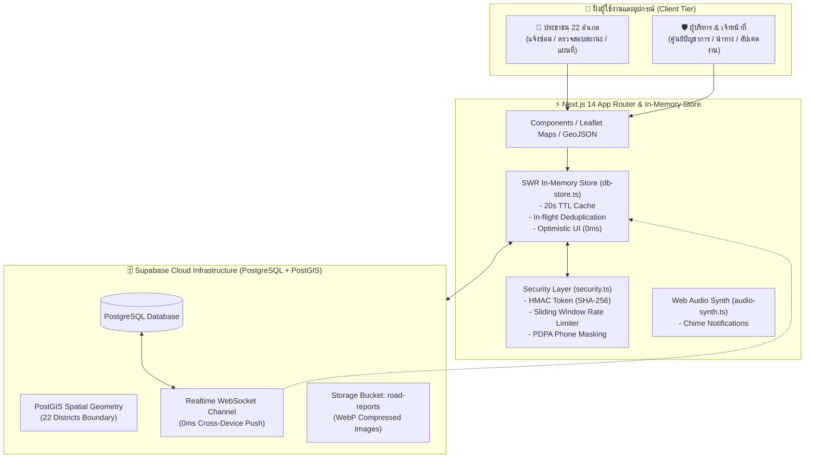

# 🛣️ Sisaket RoadGuard — คู่มือและเอกสารระบบฉบับสมบูรณ์ (Complete System Documentation)

> **ศรีสะเกษ ถนนสวย ปลอดภัย ไร้หลุม**  
> *Mobile-First Web Application แพลตฟอร์มรับแจ้งและบริหารจัดการซ่อมแซมถนนชำรุด ครอบคลุม 22 อำเภอ จังหวัดศรีสะเกษ*

---

## 📑 สารบัญเนื้อหา (Table of Contents)

1. [ภาพรวมโครงการและสถาปัตยกรรม (System Overview & Architecture)](#1-ภาพรวมโครงการและสถาปัตยกรรม)
2. [ส่วนระบบสำหรับประชาชน (Citizen-Facing Portal)](#2-ส่วนระบบสำหรับประชาชน-citizen-facing-portal)
3. [ส่วนระบบศูนย์บัญชาการเจ้าหน้าที่ (Admin Command Center)](#3-ส่วนระบบศูนย์บัญชาการเจ้าหน้าที่-admin-command-center)
4. [โครงสร้างฐานข้อมูลและความปลอดภัย (Database & Security Architecture)](#4-โครงสร้างฐานข้อมูลและความปลอดภัย)
5. [การเพิ่มประสิทธิภาพและความลื่นไหล (Performance & Smoothness Engineering)](#5-การเพิ่มประสิทธิภาพและความลื่นไหล)
6. [คู่มือการตั้งค่าและติดตั้งระบบ (Setup & Configuration Guide)](#6-คู่มือการตั้งค่าและติดตั้งระบบ)
7. [บันทึกประวัติการพัฒนาและแก้ไขล่าสุด (Changelog & Recent Milestones)](#7-บันทึกประวัติการพัฒนาและแก้ไขล่าสุด)
8. [แผนการพัฒนาต่อยอดในอนาคต (Future Roadmap)](#8-แผนการพัฒนาต่อยอดในอนาคต)

---

## 1. ภาพรวมโครงการและสถาปัตยกรรม



### 🛠️ เทคโนโลยีที่เลือกใช้ (Tech Stack)
- **Framework**: Next.js 14 (App Router, Server & Client Components)
- **Language**: TypeScript 5+ (Strict Type-Safety 100%)
- **Styling**: Tailwind CSS, Lucide React Icons
- **Mapping & GIS**: Leaflet 1.9+, GeoJSON เส้นแบ่งเขต 22 อำเภอศรีสะเกษจริง, PostGIS
- **Database & Backend**: Supabase (PostgreSQL 15+, PostGIS extension, Row Level Security, Realtime Pub/Sub Channels)
- **Storage**: Supabase Storage Bucket `road-reports` (WebP High Compression)
- **Audio Synthesizer**: Web Audio API Oscillator (Real-time chime โดยไม่ต้องโหลดไฟล์ MP3 ภายนอก)

---

## 2. ส่วนระบบสำหรับประชาชน (Citizen-Facing Portal)

### 2.1 📍 ระบบระบุพิกัดอัจฉริยะ (Smart Geofence Location Picker)
- **GPS Auto-Detection**: ค้นหาตำแหน่งปัจจุบันอัตโนมัติ พร้อมตรวจจับความถูกต้อง
- **Sisaket Geofencing (22 อำเภอ)**: มีระบบ `isWithinSisaket(lat, lng)` ตรวจสอบว่าพิกัดอยู่ในเขตจังหวัดศรีสะเกษจริง ป้องกันการรายงานนอกเขต
- **Interactive Drag & Drop**: ประชาชนสามารถเลื่อนหมุดบนแผนที่ หรือแตะเพื่อเลือกจุดเกิดเหตุได้อย่างอิสระ

### 2.2 📸 ระบบบันทึกภาพถ่าย 2 มุมมอง (Dual-Perspective Photo Upload)
- **มุมมองที่ 1: ภาพมุมกว้างบริบท (Context Photo)** — เพื่อให้ช่างมองเห็นสภาพแวดล้อม ป้ายซอย หรือเสาไฟฟ้า
- **มุมมองที่ 2: ภาพระยะใกล้ (Close-up Photo)** — เพื่อประเมินขนาด ความลึก และความอันตรายของหลุม
- **On-Device WebP Compression**: บีบอัดรูปภาพทันทีบน Browser ก่อนส่งข้อมูล ขนาดเฉลี่ยเหลือ < 300KB โหลดไว และประหยัด Bandwidth

### 2.3 ✍️ จุดสังเกตและปุ่มลัดแตะไว (Mandatory Landmark & Quick Tags)
- บังคับระบุจุดสังเกตเพื่อความแม่นยำในการลงพื้นที่ของช่าง
- ปุ่มลัดแตะไว: `[หน้าโรงเรียน]`, `[ตรงข้ามวัด]`, `[ใกล้เสาไฟ]`, `[สะพาน/ทางโค้ง]`, `[หน้าตลาด/ร้านค้า]`, `[สี่แยก/สามแยก]`

### 2.4 🎯 เลือกระดับความรุนแรง (Severity Levels)
- 🟢 `LOW` (เล็กน้อย): ผิวทางแตกร้าว ลึก < 3 ซม.
- 🟡 `MEDIUM` (ปานกลาง): หลุมกว้าง ลึก 3-5 ซม. รถชะลอตัว
- 🔴 `HIGH` (อันตราย): หลุมลึก > 5 ซม. เสี่ยงอุบัติเหตุ
- 🚨 `CRITICAL` (วิกฤต): ถนนทรุด ขาด หรือมีน้ำท่วมขังข้ามไม่ได้

### 2.5 🔍 กระเป๋าคำขอ & ระบบติดตามสถานะ (Citizen Tracking Portal)
- **รหัสติดตามเฉพาะตัว (Tracking Code)**: ออกรหัสทันที เช่น `SK2610-1994`
- **3-Tab Navigation**:
  1. `กระเป๋าของฉัน (My Wallet)`: จดจำรหัสที่เคยแจ้งบนอุปกรณ์อัตโนมัติ
  2. `ชุมชน (Community Feed)`: ดูรายงานร่วมกันในแต่ละอำเภอ
  3. `ค้นหา (Search)`: ค้นหาด้วยรหัสติดตาม หรือเบอร์โทรศัพท์
- **3-Stage Live Stepper**:
  - `รอรับเรื่อง` ⏳ ➡️ `กำลังซ่อมแซม` 🛠️ ➡️ `เสร็จสิ้นสมบูรณ์` ✨
- **Before / After Comparison**: แสดงภาพก่อนซ่อมและภาพหลังซ่อมคู่กันเมื่อช่างทำงานเสร็จ
- **ระบบ Upvote & Star Rating**: ให้ประชาชนร่วมกดสนับสนุนเคสเร่งด่วน และให้คะแนนความพึงพอใจ (1-5 ดาว) พร้อมความคิดเห็น

### 2.6 🗺️ แผนที่คำขอสาธารณะ (Public Map Feed)
- แสดงหมุดเคสทั้งหมดบนแผนที่ศรีสะเกษ
- กรองตามอำเภอพร้อมแสดงเส้นขอบเขต GeoJSON สีม่วง
- คลิกหมุดเพื่อดูข้อมูล รายละเอียด และสถานะปัจจุบัน

---

## 3. ส่วนระบบศูนย์บัญชาการเจ้าหน้าที่ (Admin Command Center)

### 3.1 🔒 ความปลอดภัยและการเข้าสู่ระบบ (Security & Authentication)
- **การเข้าใช้งาน**: เข้าผ่าน URL `/admin` หรือลิงก์ที่ Footer (ไม่มีปุ่มใน Header ประชาชน)
- **รหัส PIN พิเศษ**: บังคับใช้รหัส **`5101`** เท่านั้น (ไม่มีการแสดงคำใบ้รหัสในหน้า Login)
- **Session Token (HMAC SHA-256)**: สร้าง Token ที่มีอายุ 12 ชั่วโมง และมีระบบ Token Blacklist ทันทีที่กด Logout
- **ปุ่มออกจากระบบ (Admin Logout)**: อยู่บน Navbar ด้านบน เคลียร์ Session ทันทีเพื่อความปลอดภัยในคอมพิวเตอร์ส่วนกลาง

### 3.2 ⚡ ระบบซิงค์ข้อมูล Real-time (0ms Push & Chime Chime)
- เชื่อมต่อ **Supabase Realtime Channel** (`postgres_changes` บนตาราง `road_reports`)
- เมื่อมีประชาชนแจ้งเคสใหม่:
  - มี **เสียงระฆัง Chime สังเคราะห์** ดังเตือนเจ้าหน้าที่
  - มี **Toast Notification** มุมขวาบน แจ้งรหัสและอำเภอทันที
  - มี **Notification Bell** พร้อมตัวเลข Badge นับเคสใหม่
- ปุ่ม **Manual Refresh `[🔄]`** บนหัวตาราง สำหรับบังคับดึงข้อมูลล่าสุดจาก Supabase ได้ตลอดเวลา

### 3.3 📊 ตัวชี้วัด 5 KPI & การกรองข้อมูล
- 🚨 `เร่งด่วน/วิกฤต (Critical/High)`
- 📅 `เคสวันนี้ (Today)`
- ⏳ `รอรับเรื่อง (Pending)`
- 🛠️ `กำลังซ่อม (In-Progress)`
- ✨ `เสร็จสิ้น (Resolved)`
- เมนูดรอปดาวน์ **22 อำเภอศรีสะเกษ**: เมื่อเลือกอำเภอ แผนที่จะวาดเส้นขอบเขต GeoJSON สีม่วง และเลื่อนมุมกล้อง (FlyTo) ไปยังอำเภอนั้นอัตโนมัติ

### 3.4 🚀 การจัดการเคสแบบ 1-Click
- **📞 โทรด่วน (1-Click Call)**: ปุ่มกดโทรหาผู้แจ้งทันทีผ่าน `tel:${rep.reporter_phone}` (แอดมินเห็นเบอร์เต็ม)
- **🧭 นำทางรถซ่อม (1-Click Google Maps)**: ปุ่มเปิด Google Maps นำทางตรงไปยังพิกัด ละติจูด/ลองจิจูด
- **⚡ ปุ่มเปลี่ยนสถานะด่วน (Quick Status)**:
  - `[รับเรื่อง]` ➡️ ปรับเป็น `VERIFIED` พร้อมใส่ข้อความเริ่มต้นให้อัตโนมัติ
  - `[กำลังซ่อม]` ➡️ ปรับเป็น `IN_PROGRESS`
  - `[เสร็จสิ้น ✨]` ➡️ ปรับเป็น `RESOLVED` พร้อมบันทึกเวลาเสร็จสิ้น (`resolved_at`)
  - **Optimistic UI**: สีปุ่มและป้ายเปลี่ยนทันที 0ms พร้อม Spinner หมุนเฉพาะการ์ดที่กด ไม่เกิดอาการค้าง

### 3.5 📷 กล่องจัดการรายละเอียด & แนบภาพถ่ายหลังซ่อม (Resolution Photo)
- เมื่อคลิกเลือกการ์ดใด ๆ:
  - แผนที่จะเลื่อนจุดกึ่งกลาง (Pan) ไปยังตำแหน่งนั้นทันที
  - เปิดกล่องกรอก **ระบุชื่อทีมช่าง/หมวดทางหลวง**
  - เปิดกล่องกรอก **บันทึกความคืบหน้าถึงประชาชน**
  - มีช่อง **แนบภาพถ่ายหลังซ่อมเสร็จ**: รองรับทั้งการอัปโหลดไฟล์จากกล้อง/เครื่อง (แปลงเป็น WebP อัตโนมัติ) หรือการวางลิงก์ URL พร้อมรูปภาพ Preview ทันที

### 3.6 ⚙️ การจัดการข้อมูลขั้นสูง (Edit, Delete & Export)
- **หน้าต่างแก้ไขข้อมูลเคส**: ปรับแก้อำเภอ, ความรุนแรง, เบอร์โทรผู้แจ้ง, จุดสังเกต
- **ปุ่มลบเคสออกจากระบบ**: ลบเคสทดสอบหรือสแปมออกจากฐานข้อมูล Supabase อย่างถาวร
- **Export CSV**: ดาวน์โหลดข้อมูลรายงานทั้งหมดเป็นไฟล์ CSV เข้ารหัส UTF-8 พร้อม BOM (`\uFEFF`) รองรับภาษาไทยใน Microsoft Excel 100%

### 3.7 🎨 จัดการป้ายประชาสัมพันธ์ & ธีม (Sponsor Banners & Header)
- เพิ่ม/แก้ไข/ลบ/จัดลำดับ ป้ายประชาสัมพันธ์และผู้สนับสนุน
- รองรับการอัปโหลดรูปภาพตรงจากอุปกรณ์ หรือใส่ลิงก์ Google Drive (ระบบแปลง Direct View อัตโนมัติ)
- ปรับแต่งพื้นหลังส่วนบน (Preset ภาพแลนด์มาร์กศรีสะเกษ vs Custom Background)

---

## 4. โครงสร้างฐานข้อมูลและความปลอดภัย

### 4.1 รายการตารางใน Supabase PostgreSQL
1. **`districts`**: รายชื่อ 22 อำเภอ พิกัดศูนย์กลาง และรหัสพื้นที่
2. **`road_reports`**: ตารางเก็บรายงานถนนชำรุด
   - `id` (UUID Primary Key)
   - `tracking_code` (TEXT UNIQUE)
   - `reporter_phone` (TEXT)
   - `latitude`, `longitude` (FLOAT / PostGIS `location_geom`)
   - `district`, `subdistrict` (TEXT)
   - `landmark_description` (TEXT)
   - `photo_context_url`, `photo_closeup_url` (TEXT)
   - `resolution_photo_url` (TEXT - ภาพหลังซ่อม)
   - `severity_level` (`LOW` | `MEDIUM` | `HIGH` | `CRITICAL`)
   - `status` (`PENDING` | `VERIFIED` | `IN_PROGRESS` | `RESOLVED`)
   - `assigned_team`, `admin_notes` (TEXT)
   - `upvote_count`, `rating`, `rating_feedback`
   - `created_at`, `updated_at`, `resolved_at` (TIMESTAMPTZ)
3. **`report_timeline`**: บันทึก Log การเปลี่ยนสถานะของแต่ละเคส
4. **`sponsor_banners`**: ข้อมูลป้ายประชาสัมพันธ์
5. **`system_settings`**: ข้อมูลการตั้งค่าระบบและธีม

### 4.2 มาตรการความปลอดภัยและ PDPA Compliance
- **Phone Number Masking**: ประชาชนทั่วไปจะเห็นเบอร์โทรที่ถูกเซ็นเซอร์ เช่น `081-XXX-5678` ผ่าน View `public_road_reports` โดยมีเฉพาะผู้ที่มี Admin Session Token เท่านั้นที่จะเข้าถึงเบอร์โทรเต็มได้
- **Row Level Security (RLS)**: เปิดใช้งาน RLS บนทุกตาราง พร้อมกำหนดนโยบายความปลอดภัย
- **In-Memory Rate Limiting**: ป้องกันการส่งสแปม (จำกัด 10 เคส ต่อ 10 นาที ต่อ IP)
- **Input Sanitization**: ลบแท็กอันตราย `<>` ป้องกัน XSS Injection

---

## 5. การเพิ่มประสิทธิภาพและความลื่นไหล

| กลไกการปรับแต่ง | รายละเอียดการทำงาน | ประโยชน์ที่ได้รับ |
|---|---|---|
| **SWR In-Memory Store** | แคชข้อมูลใน RAM 20 วินาที พร้อมระบบ In-flight Request Deduplication | ลดการเรียก Supabase ซ้ำซ้อน หน้าเว็บโหลดไว 0ms |
| **Leaflet Singleton Loader** | โหลดไลบรารีแผนที่ครั้งเดียวและแชร์การทำงานร่วมกัน | ลดขนาด Bundle และป้องกันปัญหาแผนที่แครช |
| **Memory-Safe WebP Conversion** | ใช้ `URL.createObjectURL` และเคลียร์ Canvas ทันที | ลดการใช้ RAM บนมือถือลงกว่า 90% ไม่เกิดอาการกระตุก |
| **Debounced Notification** | รวมการแจ้งเตือน State Change ด้วยเวลา 150ms | ป้องกันวงจร Cascading Re-render |
| **GPU Hardware Acceleration** | ใส่ CSS `transform-gpu` และ `backface-visibility: hidden` บนแถบสไลด์ | แอนิเมชันลื่นไหล 60 FPS |

---

## 6. คู่มือการตั้งค่าและติดตั้งระบบ

### 6.1 การติดตั้งและรันในเครื่อง (Local Development)
```bash
# 1. ติดตั้ง Dependencies
npm install

# 2. ตั้งค่าตัวแปรในไฟล์ .env.local
NEXT_PUBLIC_SUPABASE_URL=https://cybjbonnardearxckoig.supabase.co
NEXT_PUBLIC_SUPABASE_ANON_KEY=sb_publishable_ow4P72Jh-Tz36aeBhalO_A_7AziO04D
ADMIN_PIN=5101
NEXT_PUBLIC_ADMIN_PIN=5101

# 3. รัน Development Server
npm run dev
```
เปิดใช้งานที่: `http://localhost:3000` (ประชาชน) และ `http://localhost:3000/admin` (แอดมิน)

### 6.2 การตั้งค่าฐานข้อมูล Supabase (1-Click SQL Setup)
- เข้าสู่ [supabase.com](https://supabase.com) เปิดโปรเจกต์ของท่าน
- ไปที่เมนู **SQL Editor**
- คัดลอกโค้ดจากไฟล์ `supabase/full_setup.sql` วางแล้วกด **RUN**
- ตรวจสอบว่ามี Storage Bucket ชื่อ `road-reports` (ตั้งเป็น Public)

---

## 7. บันทึกประวัติการพัฒนาและแก้ไขล่าสุด

- ✅ **Commit `f5b317e`**: เพิ่มปุ่ม Logout ใน Admin Navbar, เพิ่มระบบอัปโหลดและแสดงรูปภาพหลังซ่อมแซมเสร็จสิ้น (Resolution Photo) ใน Detail Drawer, เพิ่มการคลิกการ์ดเพื่อ Pan แผนที่อัตโนมัติ
- ✅ **Commit `b023a3e`**: แก้ไขปัญหาปุ่ม `[รับเรื่อง]` ค้าง โดยเปลี่ยนมารับ Parameter แบบ Direct Pass พร้อมระบบ Optimistic UI (0ms Response) และ Loading Spinner
- ✅ **Commit `a5bd086`**: เชื่อมต่อ Supabase Realtime WebSocket Channels, ซ่อนปุ่มแอดมินออกจาก Header ประชาชน, ซ่อนคำใบ้รหัส PIN, และบังคับใช้รหัสผ่าน `5101` อย่างเคร่งครัด
- ✅ **Commit `c63df6f`**: ปรับแต่งความลื่นไหลระดับ 60 FPS, SWR Store, Leaflet Singleton Loader และ WebP Memory Cleanup

---

## 8. แผนการพัฒนาต่อยอดในอนาคต

1. **🤖 AI Automatic Severity & Pothole Detection**: วิเคราะห์ขนาดหลุมและความเร่งด่วนจากภาพถ่ายด้วย Computer Vision (Gemini Flash Vision)
2. **📲 LINE Notify / LINE OA Webhook**: แจ้งเตือนส่งภาพและพิกัดเข้ากลุ่ม LINE ทีมช่างประจำแต่ละอำเภออัตโนมัติ
3. **📄 Automated PDF Work Order Export**: สร้างเอกสารใบสั่งงานซ่อมบำรุงมาตรฐานราชการสำหรับปริ้นท์ส่งมอบทีมช่างภาคสนาม
4. **📊 PWA & Offline Geotagging**: บันทึกภาพและพิกัดเก็บไว้ในเครื่องเมื่อไม่มีสัญญาณเน็ต แล้วส่งข้อมูลทันทีเมื่อต่อเน็ตได้
